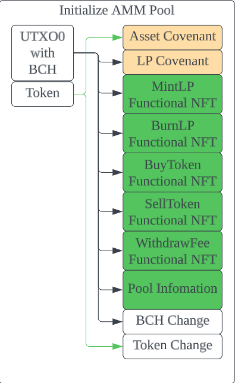
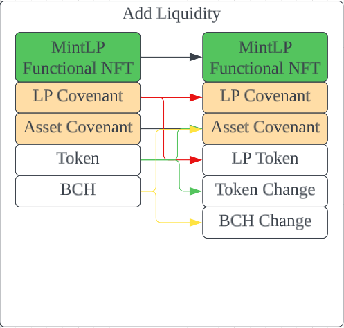
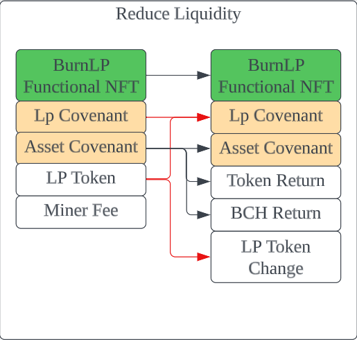
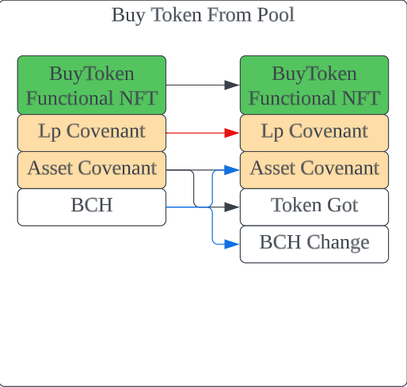
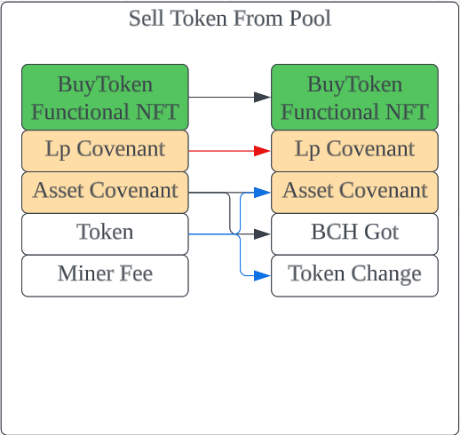

# Fex.Cash: a decentralized market of CashTokens for Bitcoin Cash

### Abstract
Fex.Cash is a decentralized market for trading CashTokens. It's built on the Bitcoin Cash blockchain using CashScript.

Fex.Cash not only provides the order market that most PoW blockchain tokens already have, but also provides a UTXO-based AMM mechanism, allowing Bitcoin Cash users to fully enjoy decentralized trading capabilities, with a user experience comparable to EVM-compatible blockchains.


## Introduction

### Background

Recently, due to the rise of [Ordinals](https://ordinals.com/) and [BRC20](https://domo-2.gitbook.io/brc-20-experiment/), more and more crypto users are setting their sights back on the PoW blockchains, and more and more developers are developing decentralized applications similar to Ordinals and BRC20 on PoW blockchains, such as [LRC20](https://litecoinlabs.gitbook.io/ltc-20-experiment-forked-from-brc-20/), [DRC20](https://docs.doginals.academy/en/introduction/drc-20-introduction), etc.

Since the latest Bitcoin Cash mainnet upgrade, the [CashTokens](https://cashtokens.org) feature is supported and users can finally use native UTXO-based tokens on Bitcoin Cash.

Unlike other PoW blockchains, CashToken is natively supported in Bitcoin Cash, so it is also easier to make more decentralized applications based on CashTokens.

Currently, most of the Token marketplaces on other PoW blockchains can only be traded in whole sheets (e.g. 1000 Tokens can be bought at a time as a whole), but this kind of trading experience is not very comfortable and not comparable to the trading marketplaces on EVM-compatible blockchains.

Therefore, in order to revitalize the Bitcoin Cash ecosystem, we decided to make a real DEX based on CashTokens.

### Smart Contract on Bitcoin Cash
[CashScript](https://cashscript.org/) is a high-level programming language for Bitcoin Cash smart contracts (Also known as [covenants](https://fc16.ifca.ai/bitcoin/papers/MES16.pdf) in Bitcoin/Bitcoin Cash) that provides a powerful abstraction layer on top of Bitcoin Script (a native virtual machine for Bitcoin Cash).

Bitcoin Cash transactions run on Bitcoin Script. However, it is difficult and error-prone for most developers to directly write bytecode for it.

CashScript has good readability, which greatly enhances the development experience and the reliability of the contract. It is on CashScript that Fex.Cash's covenants are built, and these covenants are eventually compiled into bytecode, and executed in UTXO model.

The syntax of CashScript is similar to [Solidity](https://docs.soliditylang.org/en/latest/), but its functionality is very different because Bitcoin Cash covenants are very different from EVM smart contracts. The main differences are the following:

1. The assets on Bitcoin Cash are all native. Except for ETH, which is native on [Ethereum](https://ethereum.org/en/) (Or BNB on [Binance Smart Chain](https://www.bnbchain.org/en/smartChain), etc), other assets are just the returned value of the contract's function after parsing the contracts' states, such as the assets of [ERC20](https://eips.ethereum.org/EIPS/eip-20) and [ERC721](https://eips.ethereum.org/EIPS/eip-721), which actually are the return value of `balanceOf`.

   However, in addition to BCH, the Bitcoin Cash blockchain also has two types of native tokens, fungible token (FT) and non-fungible token (NFT), which roughly correspond to the ERC20 and ERC721 assets. The information of all these assets is recorded directly in UTXO without the need of any code parsing and presenting them.

2. The basic unit on Bitcoin Cash blockchain is the UTXO, not the account.

   Contract accounts of EVM-compatible blockchains contain contract codes and data, which is the smallest unit of a DApp.

   The smallest unit of DApp on Bitcoin Cash is the UTXO, which contains assets, codes and data.

3. The script on Bitcoin Cash is used to write a checklist, not a task list.

   EVM contract specifies how to generate the new states according to the old states, so its code is like a "task list". The old states which are not affected by these tasks will remain unchanged.

   Bitcoin Cash covenants specifies what the new UTXOs should be like based on the given input UTXOs, so its code is like a "checklist". The new UTXOs' assets, codes and data are be arbitrarily choosen if they are not checked in the checklist.

### Features

Fex.Cash currently offers the following features:

1. Bulk Order. Users can put limit orders with a specified amount of tokens (usually a whole hundred or a whole thousand) as a maker, or take other people's orders.

2. [AMM](https://chain.link/education-hub/what-is-an-automated-market-maker-amm). Users can set up a trading pair with BCH and one cashtoken, spend BCHs and tokens to create a liquidity pool, and add liquidity to an existing pool. Users can also trade with the existing pool to swap BCHs/tokens.

3. Pool Ranking. Fex.Cash provides users with information about the current AMM pools and allows them to check the reserve of BCHs and tokens in each pair.

4. Asset Management. On the asset management page, users can manage their assets and LP tokens, such as depositing or withdrawing their assets. Also, they can create AMM pools using `Mint-LP` or get their assets back with `Burn-LP`.


## Technical Details

### BCH's Checklist

As mentioned in the Introduction, Bitcoin Cash smart contracts are not quite the same as those on EVM-compatible blockchains, since the former are more like checklists.

Here are some of the commonly used checks:

1. Consensus Check. A Bitcoin Cash transaction spends old UTXOs and creates new UTXOs. The consensus logic of Bitcoin Cash performs the following checking:

   a. The sum of the BCH value of inputs must be greater than the sum of the BCH value of outputs, and the excess is the miner fee.

   b. For any token category, the sum of the token amount of inputs must be greater than or equal to the sum of the token amount of outputs, and the excess will be burned.

   c. For any token category, if there is no UTXO with `minting` capability in inputs, the number of NFTs in outputs must not be more than that of inputs.

   d. For any token category, if there is no UTXO with `minting` and `mutable` capability in inputs, the `nftCommitment` in outputs must correspond to the one in inputs.

   These are just basic checks. DApp needs to make more constrain for BCH value, token amount, and `nftCommitment` to implement its logic, which is encoded in the code of UTXO.

   The consensus logic of Bitcoin Cash executes all the codes in inputs one by one to ensure that the transaction conforms to the function of the DApp.

   The code and construction parameters of a UTXO, which are called `lockingBytecode`, are not subject to any underlying checks.

   Therefore, there is no way to implement such restrictions as: no more than `N` UTXOs can be created with a certain `lockingBytecode`; output UTXOs can have a specific `lockingBytecode` only if the inputs has such `lockingBytecode`.

   So the `lockingBytecode` cannot be relied on to qualify a UTXO as "the expected one".

   The only thing that can be relied on is `nftCommitment`. It is possible to achieve such checks using the covenants code: no more than `N` UTXOs can be created with a certain `nftCommitment`; output UTXOs can have a specific `nftCommitment` only if the inputs has such `nftCommitment`.

2. Self-Preservation Check. Bitcoin Cash transactions allow token amount to get less and `nftCommitment` to disappear (burning off FTs or NFTs). To avoid users accidentally losing their assets, code needs to be written specifically to rule out the possibility of burning.

3. Interlocking Check. DApps on EVM-compatible blockchains are rarely based on one single contract. However, they usually require several contracts to call each other.

   DApps on Bitcoin Cash also require several different UTXOs to work together to achieve a specific feature. Therefore, a UTXO often needs to specify which other UTXOs it must work with, for example, some UTXOs must be used together as inputs in a transaction.

   There are two mechanisms for interlocking:

   a. Soft Interlocking. Implemented via `nftCommitment` and `tokenCategory` to ensure that only UTXOs in the same `tokenCategory` can accompany themselves as inputs.

   b. Hard Interlocking. Implemented by `outpointTransactionHash`, which binds two or more UTXOs to be always spent as inputs and created as outputs simultaneously.

### Customized Multiplication and Division

Since the multiplication in Bitcoin Cash scripts may cause [overflow problems](https://bitcoincashresearch.org/t/the-need-for-additional-math-opcodes/1087), the AMM of Fex.Cash implementation defines a custom multiplication and division method.

#### Variable Definition

```
   let TwoExp30 = 1073741824; // 2 ** 30
```

   `TwoExp30` is roughly one billion, a large enough number.

#### Purpose of Calculation
   Given `r ∈ [0, TwoExp30)`.

   If we want to calculate `a * r / TwoExp30`, the expression`a * r` is likely to overflow， but `(a/TwoExp30) * r` and `(a%TwoExp30) * r` are not overflow.

   If we want to calculate `a * TwoExp30 / r`， the expression `a * TwoExp30` is likely to overflow, but `(a/r) * TwoExp30` and `(a%r) * TwoExp30` are not overflow.

#### Derivation
```
   a * (x/y) = (floor(a/y) * y + (a%y)) * (x/y)
             = (floor(a/y) * y * (x/y) + (a%y) * (x/y)
             = (floor(a/y) * x + (a%y) * x / y
```

   If `x = r, y = TwoExp30`, then:
   `a * r / TwoExp30 = floor(a/TwoExp30) * r + (a%TwoExp30) * r / TwoExp30`

   If `x = TwoExp30, y = r`, then:
   `a * TwoExp30 / r = floor(a/r) * TwoExp30  + (a%r) * TwoExp30 / r`

#### Usage in Fex.Cash

   According to [UniswapV2](https://github.com/Uniswap/v2-core), when users add liquidity in AMM, we have the following formula:

```
   newLpTokenSupply  = lpTokenSupply * (totalTokenInPool+userInputToken) / totalTokenInPool
```

   `newLpTokenSupply` is the total supply of LP tokens in the pool after users add liquidity.

   Then:
```
   newLpTokenSupply = lpTokenSupply / ( totalTokenInPool / (totalTokenInPool+userInputToken) )
```

   Let `totalTokenInPool / (totalTokenInPool+userInputToken) = r / TwoExp30`, and apply the formula we derived above, we can obtain the following calculation code in `mint_lp_token.cash`:

```
   int newLpTokenSupply = (((lpTokenSupply/r)*1073741824) + ((lpTokenSupply%r)*1073741824)/r);
```

   Similarly, when users burn liquidity, there is the code in `burn_lp_token.cash`:

```
   int newLpTokenSupply = ((lpTokenSupply/1073741824)*r + ((lpTokenSupply%1073741824)*r)/1073741824);
```

   Likewise, when users buy or sell tokens, the code is:

```
   // sell_token_to_pool.cash
   int newTokenAmount = (((tokenAmount/r)*1073741824) + ((tokenAmount%r)*1073741824 + r - 1)/r);
   
   // buy_token_to_pool.cash
   int newTokenAmount = ((tokenAmount/1073741824)*r + ((tokenAmount%1073741824)*r + 1073741823)/1073741824);
```

   The last term `... r - 1) / r` and `... 1073741823)/1073741824` is used to round the result upwards.


### Bulk Order

The Bulk Order feature has 2 contracts, `bulk_buy.cash` and `bulk_sell.cash`.

In these smart contracts, both provide `trade` and `cancel` functions, corresponding to taking orders and canceling orders.

Bulk Order implements 3 functions:

1. Make Order. After the maker creates a buy/sell contract, sending BCHs or tokens to the contract's P2SH address can create the corresponding buy or sell order.

2. Take Order. Taker can call the `trade` function (more precisely, prepare a transaction that meets the conditions checked inside the `trade` function) to match the maker's order.

3. Cancel Order. Maker can call the `cancel` function (more precisely, prepare a transaction that meets the conditions checked inside the `cancel` function) to cancel his/her order.

### UTXO-Based AMM

UTXO-Based AMM is one of the highlighted feature of Fex.

There are 7 covenants around the AMM feature, which are:

1. `asset_covenant.cash`, which holds two tokens in the AMM Pool, one of which must be BCH.

2. `lp_covenant.cash`, which holds the liquidity tokens that have not yet been distributed to users, and the fees collected for the project owner, with `nftCommitment=0`.

3. `mint_lp_token.cash`, which is responsible for minting liquidity (distributing liquidity tokens to users), with `nftCommitment=1`.

4. `burn_lp_token.cash`, which is responsible for burning liquidity (getting liquidity tokens back from users), with `nftCommitment=2`.

5. `buy_token_from_pool.cash`, through which the user spends BCHs to buy tokens from the pool, with `nftCommitment=3`.

6. `sell_token_to_pool.cash`, through which the user sells the tokens to the pool to get the BCHs, with `nftCommitment=4`.

7. `withdraw_fee.cash`, from which the project owner can extract the accumulated fee in Lp Covenant, with `nftCommitment=5`.

The `spend` functions of them specify the logic of Fex. The last five NFTs, also named as Functional NFTs, are only used to implement the logic and hold no tokens.

The basic logic inside the Functional NFT is spending the existing Lp-Covenant and Asset-Covenant to create a new Lp-Covenant and an Asset-Covenant.

These 5 Functional NFTs ensure the following two properties:

1. Self-Preservation. Being spent and then immediately created again, while keeping the code, `tokenCategory` and `nftCommitment` unchanged:

   For Asset Covenant, its `lockingBytecode`/`tokenCategory` needs to remain unchanged, it does not have the `nftCommitment` attribute.

   For Lp Covenant, its `lockingBytecode`/`tokenCategory`/`nftCommitment` needs to remain unchanged.

   For Functional NFTs, their `lockingBytecode`/`tokenCategory`/`nftCommitment` need to remain unchanged.

   In each AMM transaction, the 0th input and output must be one of the Functional NFTs, the 1st input and output must be an Lp-Covenant, and the 2nd input and output must be an Asset-Covenant.

2. Interlocking. They must be used as inputs with each other simultaneously:

   For Lp-Covenant and Asset-Covenant, they interlock via `outpointTransactionHash` (Soft Interlocking).

   For Lp-Covenant and Functional NFTs, they interlock via `tokenCategory`/`nftCommitment` (Hard Interlocking).

The main functions of AMM in Fex.Cash is as follows:

1. Initialize AMM Pool. Users can create AMM pools and price this token when the token doesn't have a trading pair yet.

   A small amount of BCHs and tokens is burned during initialization (the product of consumed BCHs and tokens is about `1e6 * 1e6`, in satoshi).

   When the pool is initialized, 8 outputs will be created, the first 7 outputs are the covenants corresponding to the above, and the last output is an NFT which shows pool information.
   
   

2. Mint (Add) Liquidity. The function of adding liquidity is in `mint_lp_token.cash` covenant, users can add liquidity according to the ratio of the current pool's tokens and BCHs.

   After adding liquidity, BCHs and tokens will be stored in Asset-Covenant, and users will get the LP tokens issued by `lp_covenant.cash` Token.

   

3. Burn (Reduce) Liquidity. The reducing liquidity function is in the `burn_lp_token.cash` covenant, where users can put LP tokens back into `lp_covenant.cash` and then retrieve their share of BCH and Token in `asset_covenant.cash` (please note the infrequent loss).
   
   

4. Swap. The swap function is in `buy_token_from_pool.cash` and `sell_token_to_pool.cash`, users can buy or sell tokens with pools, and the price will be changed constantly according to the ratio of BCH reserves and token reserves.

   During the swap, users need to pay a 0.6% commission, of which 0.2% of the BCHs and 0.2% of the tokens go to the liquidity provider and 0.2% of the BCHs go to the Fex.Cash project.

   

   

To prevent overflow, when adding/reducing liquidity and buying/selling tokens operations, you don't directly enter the number of tokens or BCHs, but rather a scaling parameter `r`, and then calculate the actual number of BCHs or tokens needed using the customized multiplication and division method mentioned above.

## Conclusion
It's all just the beginning! As the CashTokens feature is launched, more and more applications will be developed on Bitcoin Cash in the future. 

First of all, we would like to thank the developers of CashTokens for bringing new possibilities to Bitcoin Cash.

Also, many thanks to some of the community developers who helped review the smart contracts, their valuable input helped us a lot in our development. 

Finally, thank you to all the users in the Bitcoin Cash community. You are the root of Fex.Cash!
